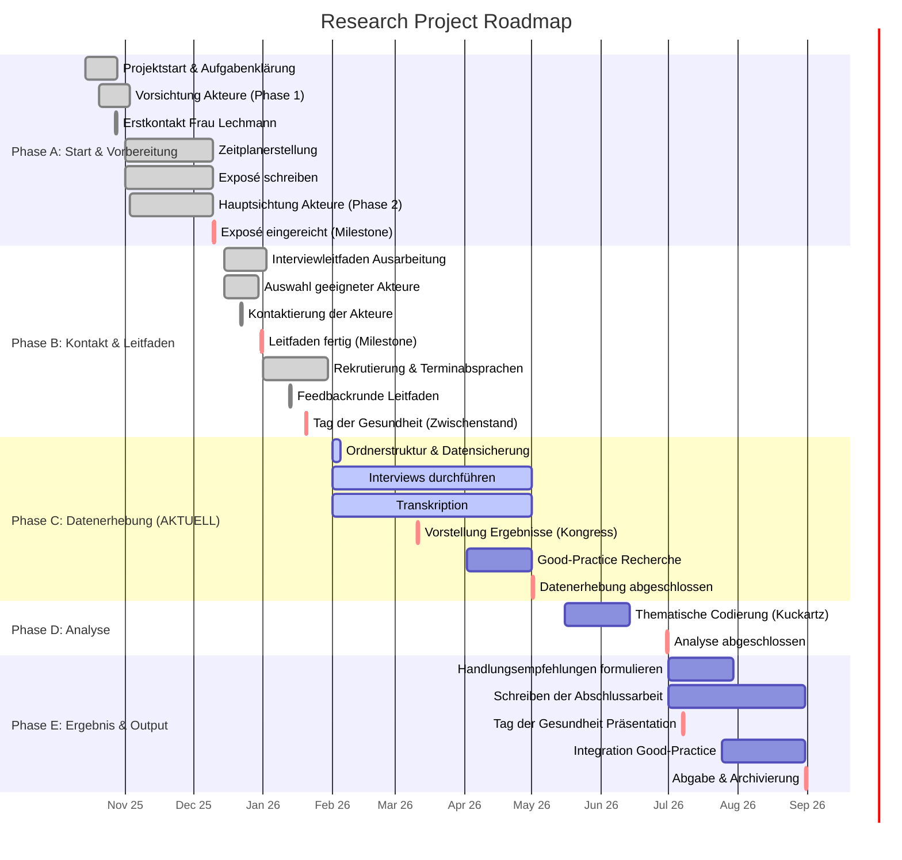

# 📅 Projekt-Meilensteinplanung & Zeitplan

> [!INFO] Status
> **Aktuelles Datum:** 04.02.2026
> **Aktuelle Phase:** Phase C - Datenerhebung
> **Nächster Meilenstein:** Ordnerstruktur & Datensicherung (05.02.26)

## 📊 Visueller Zeitplan (Gantt)

---

## 📝 Detaillierte Aufgabenliste

### ✅ Phase A: Projektstart & Vorbereitung (Abgeschlossen)
| Aufgabe | Zeitraum | Status | Verantwortlich |
| :--- | :--- | :--- | :--- |
| Projektstart & Aufgabenklärung | 14.10.25 - 28.10.25 | ✅ Erledigt | Alle |
| Vorsichtung Akteure | 20.10.25 - 03.11.25 | ✅ Erledigt | |
| Zeitplan & Exposé | 01.11.25 - 10.12.25 | ✅ Erledigt | Nina, Sophie |
| **Exposé eingereicht** | **10.12.25** | 🏁 **Meilenstein** | |

### ✅ Phase B: Kontakt & Leitfaden (Abgeschlossen)
| Aufgabe | Zeitraum | Status | Verantwortlich |
| :--- | :--- | :--- | :--- |
| Ausarbeitung Interviewleitfaden | 15.12.25 - 03.01.26 | ✅ Erledigt | Nina, Sophie |
| Auswahl Akteure | 15.12.25 - 30.12.25 | ✅ Erledigt | Andreas, Nadine |
| **Leitfaden fertig** | **31.12.25** | 🏁 **Meilenstein** | |
| Rekrutierung & Termine | 01.01.26 - 30.01.26 | ✅ Erledigt | |

### 🚀 Phase C: Datenerhebung (Laufend)
| Aufgabe | Zeitraum | Status | Verantwortlich |
| :--- | :--- | :--- | :--- |
| **Ordnerstruktur & Datensicherung** | **01.02.26 - 05.02.26** | 🔄 **In Arbeit** | |
| **Interviews durchführen** | **01.02.26 - 01.05.26** | 🔄 **In Arbeit** | |
| **Transkription** | **01.02.26 - 01.05.26** | 🔄 **In Arbeit** | |
| Vorstellung Ergebnisse (Kongress) | 11.03.26 | 📅 Geplant | |
| Good-Practice Recherche | 02.04.26 - 01.05.26 | 📅 Geplant | |
| **Datenerhebung abgeschlossen** | **01.05.26** | 🏁 **Meilenstein** | |

### 🔮 Phase D: Analyse (Geplant)
| Aufgabe | Zeitraum | Status | Verantwortlich |
| :--- | :--- | :--- | :--- |
| Thematische Codierung (Kuckartz) | 16.05.26 - 14.06.26 | 📅 Geplant | |
| **Analyse abgeschlossen** | **30.06.26** | 🏁 **Meilenstein** | |

### 🏁 Phase E: Ergebnis & Output (Geplant)
| Aufgabe | Zeitraum | Status | Verantwortlich |
| :--- | :--- | :--- | :--- |
| Handlungsempfehlungen formulieren | 01.07.26 - 30.07.26 | 📅 Geplant | |
| Schreiben der Abschlussarbeit | 01.07.26 - 31.08.26 | 📅 Geplant | |
| Tag der Gesundheit Präsentation | 07.07.26 | 📅 Geplant | |
| **Abgabe & Archivierung** | **31.08.26** | 🏁 **Meilenstein** | |