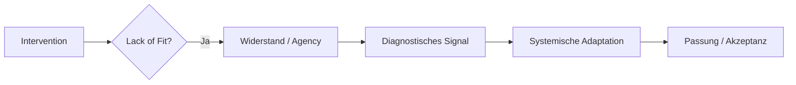

# Widerstand als diagnostische Ressource in Community Health Systems: Eine Analyse der ITN-Distribution in Uganda durch die Linse der Biomacht

## 1. Einleitung

### 1.1 Problemstellung und Relevanz im Global Health Diskurs
Die globale Gesundheitsarchitektur des 21. Jahrhunderts steht vor einem Paradoxon: Während die biomedizinische Forschung hocheffiziente Technologien wie Vakzine oder insektizid-imprägnierte Netze (ITNs) bereitstellt, scheitern diese Interventionen signifikant oft auf der „letzten Meile“. Dieses „Implementation Gap“ wird im dominanten Diskurs häufig als Defizit der Zielpopulation gerahmt. Unter dem Label der „Non-Compliance“ wird Gemeinschaften Irrationalität oder mangelnde Aufklärung attestiert – eine paternalistische Perspektive, die strukturelle Machtasymmetrien verschleiert. Wenn Gesundheitsprogramme lediglich als logistische Operationen begriffen werden, bleiben die soziopolitischen Ursachen von Ablehnung unsichtbar. Angesichts der massiven Investitionen globaler Gesundheitsfonds ist die Analyse dieser Widerstandsphänomene keine akademische Fingerübung, sondern eine ethische und ökonomische Notwendigkeit für die Legitimation von Community Health Systems (CHS).

### 1.2 Forschungsfrage und Zielsetzung
Diese Arbeit bricht mit der defizitorientierten Lesart und postuliert Widerstand als rationales Feedback-Signal. Er verweist auf einen fundamentalen „Lack of Fit“ zwischen der technokratischen Systemlogik internationaler Geber und der ökonomischen Lebensweltlogik der Empfänger.
Leitend ist die Forschungsfrage:
*Inwiefern lässt sich der Widerstand gegen ITN-Distributionen in Uganda mittels Foucaults Theorie der Biomacht als rationale Handlung dekonstruieren, und welche diagnostischen Signale liefert dieser für die Neugestaltung partizipativer Systeme?*
Ziel ist die Entpathologisierung von Widerstand: Die Zweckentfremdung von Moskitonetzen wird hier nicht als Fehler, sondern als Ausdruck kalkulierter Agency unter prekären Bedingungen lesbar gemacht. Partizipation wandelt sich damit vom Buzzword zur epistemischen Voraussetzung für Interventionen.

### 1.3 Methodisches Vorgehen
Die Untersuchung folgt dem Ansatz einer systematischen qualitativen Literaturanalyse. Der Forschungsprozess trianguliert soziologische Basistheorien (Foucaults Machtanalytik, Habermas’ System/Lebenswelt, Goffmans Institutionentheorie) mit aktueller empirischer Evidenz der Global Health Forschung (2015–2025).
Die Selektion der Quellen erfolgte nach drei Kriterien:
1.  **Theoretische Passung:** Eignung zur Analyse von Machtasymmetrien in Gesundheitsinterventionen.
2.  **Empirische Relevanz:** Fokus auf Subsahara-Afrika und Vektorkontrollprogramme (ITN).
3.  **Diagnostische Validität:** Studien, die quantitative Barrierenmodelle mit qualitativen Erklärungsansätzen verknüpfen.
Das Vorgehen verbindet dabei deduktive Theoriearbeit mit einer induktiven Validierung am Fallbeispiel Uganda, um abstrakte Machtkritik in konkrete Handlungsempfehlungen zu übersetzen.

---

## 2. Theoretischer Rahmen

### 2.1 Community Health Systems (CHS) im Spannungsfeld
CHS operieren als hybride Schnittstellen zwischen formalen Gesundheitssystemen und lokalen Gemeinschaften. Während politische Rhetorik das „Empowerment“ betont, folgt die Praxis oft einer instrumentellen Logik: Community Health Workers (CHWs) werden als kostengünstige Verlängerung des staatlichen Arms eingesetzt, um globale Indikatoren (z.B. Malaria-Inzidenz) zu optimieren (Kane et al. 2016). Dieses funktionale Ungleichgewicht bildet den strukturellen Nährboden für Konflikte.

### 2.2 Biopolitik: Die Verwaltung des Lebens
Nach Michel Foucault ist Public Health ein klassisches Feld der „Biomacht“. Sie zielt nicht auf den Tod (wie die Souveränitätsmacht), sondern auf die Optimierung des Lebens. Perron et al. (2005) differenzieren hierbei präzise:
1.  **Anatomo-Politik:** Die Disziplinierung des individuellen Körpers (*docile bodies*). Das Individuum soll Normen verinnerlichen (z.B. „Schlafe unter dem Netz“).
2.  **Biopolitik der Bevölkerung:** Das Management des Kollektivkörpers durch Statistik, Demografie und Epidemiologie.
Widerstand in Uganda ist in diesem Kontext der Versuch, sich dieser doppelten Zugriffsgewalt – der Normierung des Schlafverhaltens und der statistischen Erfassung – zu entziehen.

### 2.3 System vs. Lebenswelt: Die Logik des „Lack of Fit“
Habermas’ Dichotomie von „System“ und „Lebenswelt“ schärft den Blick für die Kollision zweier Rationalitäten. Das *System* (Geber, Staat) agiert zweckrational nach Effizienz und Protokollen. Die *Lebenswelt* (Dorf, Familie) operiert nach der Logik sozialer Beziehungen und akuter Existenzsicherung.

**Tabelle 1: Divergierende Rationalitäten (adaptiert nach Habermas)**

| Kategorie                    | **Primäres Ziel**                      | **Zeithorizont**            | **Wissenstyp**              | **Wahrnehmung**               |
| ---------------------------- | -------------------------------------- | --------------------------- | --------------------------- | ----------------------------- |
| System-Logik (Top-Down)      | Statistische Risikoreduktion (Malaria) | Zukunft (Prävention)        | Biomedizinisch, quantitativ | Mensch als Datenträger/Fall   |
| Lebenswelt-Logik (Bottom-Up) | Akute Existenzsicherung (Hunger)       | Gegenwart (Überleben heute) | Pragmatisch, kontextuell    | Mensch als handelndes Subjekt |

Ein „Lack of Fit“ entsteht, wenn Systemimperative die Lebenswelt kolonialisieren. Psychologische Reaktanz ist die Folge: Die Verteidigung der Handlungsautonomie gegen eine Intervention, die lokale Komplexität (z.B. Nahrungsknappheit) ignoriert.

---

## 3. Machtasymmetrien in CHS

### 3.1 Agents of Care vs. Agents of the State
Das Selbstbild des CHW als „Health Hero“ kollidiert oft mit der Wahrnehmung der Bevölkerung. Perron et al. (2005) identifizieren eine kritische Rollenambivalenz: Der intendierte *Agent of Care* transformiert sich in den Augen der Community zum *Agent of the State*. In Regionen, wo der Staat primär durch Vernachlässigung oder Repression präsent ist, wird der CHW – ausgestattet mit Uniform und Tablet – zum Symbol staatlicher Übergriffigkeit. Er bringt nicht nur Medikamente, sondern auch die „Blicke des Staates“ in die Privatsphäre.

### 3.2 Epistemische Ungerechtigkeit
Ein subtiler, aber wirkmächtiger Faktor ist die Hierarchisierung von Wissen. Lokales Erfahrungswissen wird systematisch als „unwissenschaftlich“ abgewertet („Epistemizid“). Wenn biomedizinische Protokolle traditionelle Praktiken ohne Dialog ersetzen, fungiert Widerstand als Schutzmechanismus kultureller Identität und Deutungshoheit.

### 3.3 Digitale Überwachung und die Erosion des Privaten
Die Digitalisierung von CHS (mHealth) verschärft diese Asymmetrie. Das Erfassen sensibler Haushaltsdaten auf Tablets bewirkt eine Form der *Mortifikation* (in Anlehnung an Goffman): Das Individuum wird seiner biografischen Einzigartigkeit beraubt und in einen standardisierten Datensatz transformiert. Zwar wird der private Haushalt nicht zur „totalen Institution“ im strengen Sinne, doch nähern sich die Mechanismen funktional an: Der Wohnraum wird transparenter, das Verhalten überwachbar, und die Bewohner werden zu Objekten einer externen Verwaltung, deren Regeln sie nicht mitbestimmt haben.

---

## 4. Widerstand als diagnostisches Feedback-Instrument

### 4.1 Dekonstruktion der „Non-Compliance“
Der Begriff „Non-Compliance“ ist analytisch wertlos, da er ein relationales Problem einseitig dem schwächeren Akteur anlastet. Widerstand muss stattdessen als *Agency* begriffen werden – als Fähigkeit, innerhalb prekärer Strukturen rationale Entscheidungen zu treffen, die der eigenen Lebensweltlogik (oft schlicht dem Überleben) dienen.

### 4.2 Der diagnostische Feedback-Zirkel
Entpathologisiert man Widerstand, wird er zu einer wertvollen Datenquelle. Er zeigt präzise an, wo die Intervention die Realität der Zielgruppe verfehlt.

### 4.3 Statistische Evidenz: Misstrauen als Hauptfaktor
Mahmoodi et al. (2023) liefern die quantitative Untermauerung für diese These. Ihr Modell erklärt 57% der Barrieren-Varianz, wobei „Institutionelles Misstrauen“ mit 28% den stärksten Einzelfaktor bildet. Dies belegt: Widerstand ist selten ein Wissensproblem, sondern eine politische Reaktion auf ein als unzuverlässig oder übergriffig wahrgenommenes System.

---

## 5. Fallstudie: ITN-Distribution in Uganda

### 5.1 Die Ökonomie des Überlebens am Victoriasee
Die ITN-Kampagnen in den Fischergemeinden am Victoriasee illustrieren den Zusammenprall von Anatomo-Politik und Überlebensökonomie drastisch. Für die Geber ist das Netz ein medizinisches Gerät zum Schutz eines schlafenden Körpers. Für den Fischer ist es ein hochwertiges Produktionsmittel in einem Kontext extremer Ressourcenknappheit.

**Tabelle 3: Divergierende Kosten-Nutzen-Kalküle**

| Faktor             | Perspektive Global Health (Geber) | Perspektive Fischer (Uganda)       |
| :----------------- | :-------------------------------- | :--------------------------------- |
| **Ressource**      | Moskitonetz (Prävention)          | Moskitonetz (Produktionsmittel)    |
| **Bedrohung**      | Malaria (abstrakt/zukünftig)      | **Hunger** (konkret/unmittelbar)   |
| **Handlungslogik** | Biomedizinische Rationalität      | Ökonomische Überlebensrationalität |

### 5.2 Taktische Repolitisierung von Ressourcen
Die Verwendung der Netze zum Fischfang ist kein „Missbrauch“, sondern eine *taktische Repolitisierung* der Ressource. Der Fischer entzieht das Objekt der biopolitischen Codierung (Gesundheitsschutz) und führt es einer ökonomischen Verwertung zu.
Die Logik ist zwingend: Ein Malariarisiko ist probabilistisch und liegt in der Zukunft; Hunger ist deterministisch und akut. Wer das Netz zum Fischen nutzt, handelt im Sinne seiner unmittelbaren Selbsterhaltung hochgradig rational. Der „Lack of Fit“ besteht in der Ignoranz des Gesundheitsprogramms gegenüber der Tatsache, dass ohne ökonomische Sicherheit (Nahrung) kein Gesundheitsbewusstsein existieren kann. Widerstand fungiert hier als Indikator für eine Intervention, die biologisches Leben schützen will, aber die ökonomischen Bedingungen dieses Lebens ignoriert.

---

## 6. Diskussion und Handlungsempfehlungen

### 6.1 Von der Edukation zur strukturellen Kopplung
Die Analyse zeigt: Mehr „Aufklärung“ ist die falsche Antwort auf strukturellen Widerstand. Wenn Netze aus Hunger zum Fischen genutzt werden, muss die Intervention Ernährungssicherheit adressieren, nicht Malaria-Biologie.
**Empfehlung:** Global Health Initiativen müssen *Livelihood-Ansätze* integrieren. Die Distribution von ITNs in Fischergemeinden muss mit Programmen zur nachhaltigen Nahrungssicherung oder der Bereitstellung adäquater Fischereiausrüstung gekoppelt werden. Nur wenn die ökonomische Notwendigkeit zur Zweckentfremdung entfällt, kann die gesundheitliche Nutzung greifen.

### 6.2 Messbarkeit jenseits quantitativer KPIs
Um echte Co-Creation zu evaluieren, genügen quantitative Indikatoren (verteilte Netze) nicht. Es bedarf narrativer Metriken, wie der *Most Significant Change (MSC)* Methode. Hierbei wird Erfolg nicht an Compliance-Raten gemessen, sondern an der qualitativen Veränderung der Machtbalance und der Entscheidungssouveränität der Community. Ein erfolgreiches CHS ist eines, das Feedback-Schleifen institutionalisiert und Widerstand nicht sanktioniert, sondern als Anlass für strukturelle Anpassungen nutzt.

---

## 7. Fazit

Die Untersuchung der ITN-Distribution in Uganda verdeutlicht, dass Widerstand gegen CHS keine pathologische Abweichung, sondern ein valides diagnostisches Signal ist. Durch die Brille von Foucaults Biomacht wird erkennbar, dass die „Zweckentfremdung“ von Netzen eine rationale Überlebensstrategie gegen einen strukturellen „Lack of Fit“ darstellt. Wenn Gesundheitssysteme die ökonomischen Realitäten der Lebenswelt ignorieren, provoziert die Intervention ihre eigene Ablehnung.
Zukunftsfähige Global Health Praxis muss sich von der paternalistischen Verwaltung von Körpern verabschieden und echte Co-Creation wagen. Das bedeutet konkret: Ökonomische Sicherheit muss als integraler Bestandteil von Gesundheitsinterventionen begriffen werden. Wer Widerstand ernst nimmt, statt ihn weg-edukieren zu wollen, gewinnt den entscheidenden Partner für nachhaltige Gesundheit: die autonome Bevölkerung selbst.

---

## Literaturverzeichnis

*   **Dreyfus, H. L., & Rabinow, P. (1982).** *Michel Foucault: Beyond Structuralism and Hermeneutics.* Chicago: University of Chicago Press.
*   **Foucault, M. (1976).** *Der Wille zum Wissen: Sexualität und Wahrheit 1.* Frankfurt am Main: Suhrkamp.
*   **Habermas, J. (1981).** *Theorie des kommunikativen Handelns.* Frankfurt am Main: Suhrkamp.
*   **Kane, S., et al. (2016).** Limits and opportunities to community health worker empowerment. *Social Science & Medicine*, 164, 27–34.
*   **Mahmoodi, H., et al. (2023).** Barriers to implementing health programs based on community participation. *BMC Public Health*, 23, 2019.
*   **Perron, A., et al. (2005).** Agents of care and agents of the state: Bio-power and nursing practice. *Journal of Advanced Nursing*, 50(5), 536–544.
*   **World Health Organization (2023).** *Community health systems: leverage points for health systems strengthening.* Geneva: WHO.
