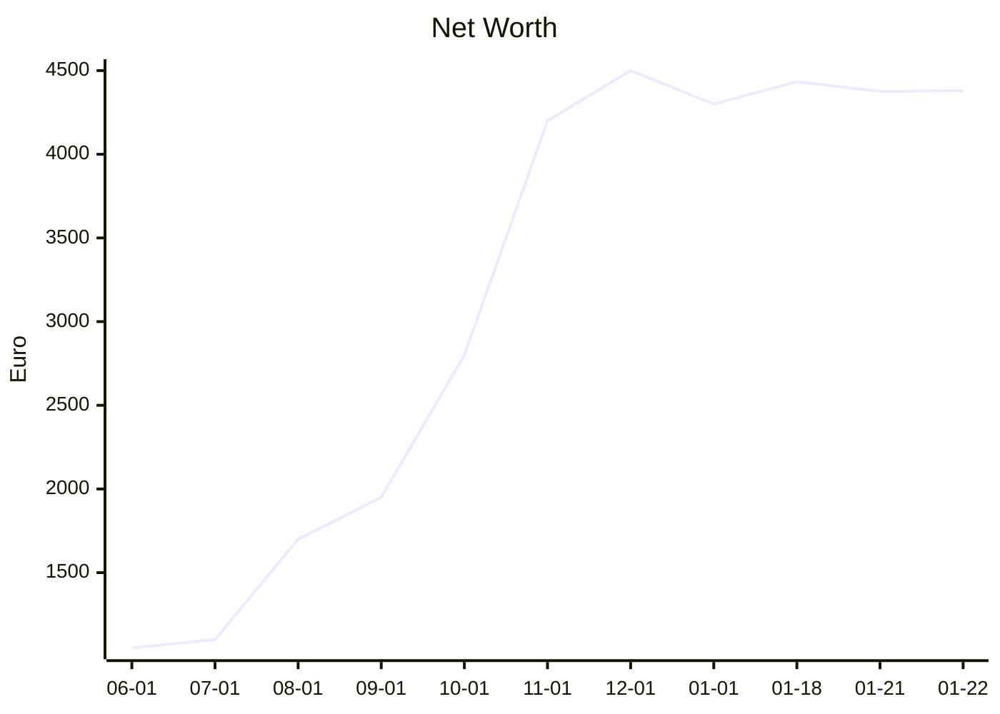
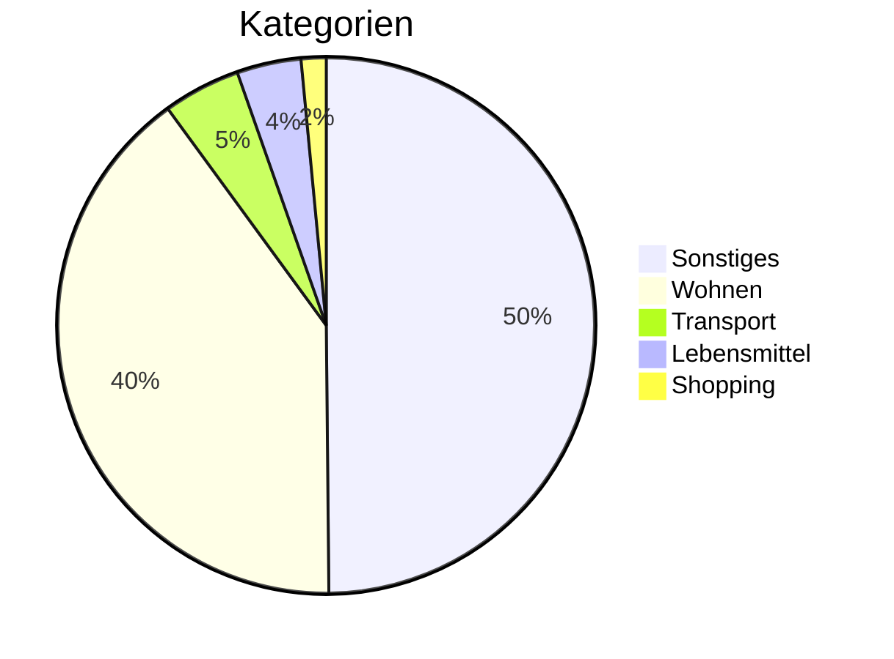

# 🏰 Master Finance Dashboard
> **Update:** 22.01.2026 16:49

## 🏆 Net Worth: `4,380.96 €`
| Asset | Wert |
| :--- | :--- |
| 📈 T212 Invest | `4,332.61 €` |
| 💵 T212 Cash | `0.05 €` |
| 🔴 Sparkasse | `240.87 €` |
| 🔵 Revolut | `-192.57 €` |

## 📈 Verlauf

## 🔄 Fixkosten (Est.)
| Payee | Amount |
| :--- | :--- |
|  | -1.30 € |
| alexandra thomas | -39.90 € |
| amazon | -9.99 € |
| amazon | -6.99 € |
| amazon digital germa | -2.99 € |
| amazon payments euro | -27.99 € |
| amazon payments euro | -9.99 € |
| amazon payments euro | -6.99 € |
| audible gmbh | -0.99 € |
| consors finanz bnp p | -87.00 € |
| consors finanz bnp p | -21.71 € |
| dak-gesundheit | -147.23 € |
| etoro | -500.00 € |
| exaring | -29.99 € |
| exaring | -1.00 € |
| franz gremmelspacher | -310.00 € |
| google | -21.99 € |
| google | -7.49 € |
| google play | -21.99 € |
| ionos se             | -1.50 € |
| ionos se             | -1.00 € |
| microsoft | -3.00 € |
| microsoft | -1.00 € |
| microsoft 365 | -3.00 € |
| microsoft payments | -3.00 € |
| microsoft store | -3.00 € |
| paypal europe s.a.r. | -4.99 € |
| paypal europe s.a.r. | -4.80 € |
| paypal europe s.a.r. | -1.00 € |
| prime video | -2.99 € |
| rsg group gmbh | -24.90 € |
| spotify | -5.99 € |
| studierendenwerk fre | -20.00 € |
| too good to go | -4.80 € |
| um eur auto von eur  | -50.00 € |
| um eur klamotten von | -50.00 € |
| um eur rainy day von | -10.00 € |
| um eur rainy day von | -5.10 € |
| um eur rainy day von | -5.00 € |
| um eur rainy day von | -2.00 € |
| um eur rainy day von | -0.10 € |
| vodafone gmbh        | -40.39 € |
| youtube | -7.49 € |
**Total: -1,510.58 €**

## 🛍️ Ausgaben (30d)

