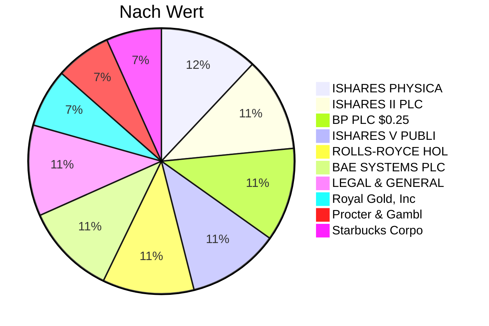
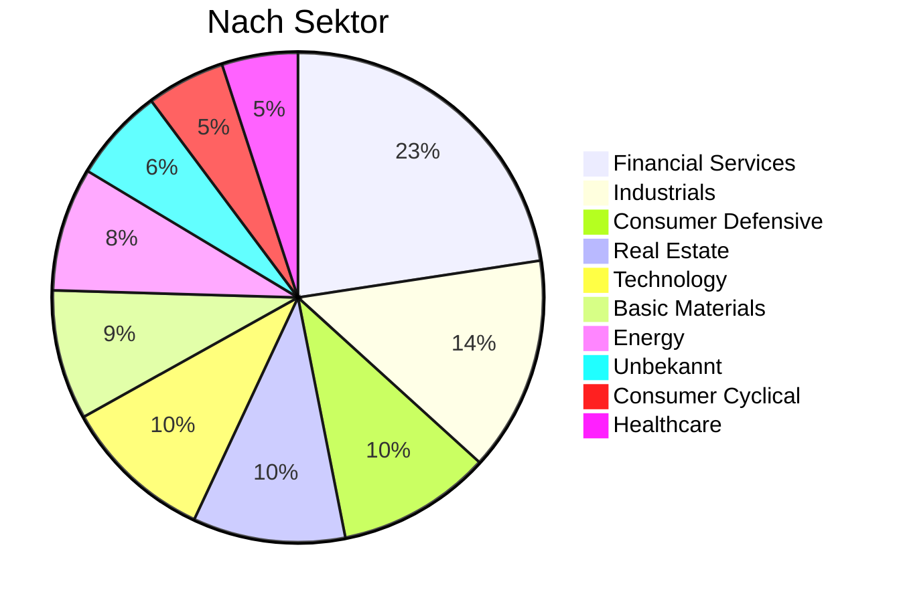

# 🦅 Trading Cockpit
> **Update:** 22.01.2026 16:49

## 💰 Finanz-Übersicht
| Metrik | Wert |
| :--- | :--- |
| **Gesamtwert** | **4,332.66 €** |
| 💸 Investiert | 4,099.26 € |
| 💵 Cash | 0.05 € |
| 📈 G/V | 🟢 146.75 € (3.58%) |

> **Qualität:** 💎=Top (CAGR>5%, Payout<80%) | 🚀=Growth (>10%) | ⚠️=Payout>100% | 🔻=Kürzung

---

## 🍰 Portfolio Allokation
### Top 10 Holdings

### Sektoren

## 📊 Positionen
| Name | Sektor | Wert | G/V | Quali |
| :--- | :--- | :--- | :--- | :--- |
| **ISHARES PHYSICAL METALS PLC ISH** | Unbekannt | 181.80 € | 0.05% |  |
| **ISHARES II PLC ISHRS DEV MRKTS ** | ETF/Unbekannt | 173.71 € | 0.00% |  |
| **BP PLC $0.25** | Energy | 173.40 € | 0.00% | ⚠️ |
| **ISHARES V PUBLIC LIMITED COMPAN** | Unbekannt | 169.99 € | -0.03% |  |
| **ROLLS-ROYCE HOLDINGS PLC ORD SH** | Industrials | 169.28 € | -0.02% |  |
| **BAE SYSTEMS PLC ORD 2.5P** | Industrials | 168.99 € | -0.03% | 💎 |
| **LEGAL & GENERAL GROUP PLC ORD 2** | Financial Services | 167.98 € | -0.03% | ⚠️ |
| **Royal Gold, Inc.** | Basic Materials | 108.10 € | 21.91% | 💎 |
| **Procter & Gamble Company (The)** | Consumer Defensive | 103.49 € | 4.08% | 💎 |
| **Starbucks Corporation** | Consumer Cyclical | 101.62 € | 12.71% | ⚠️ |
| **Coca-Cola Company (The)** | Consumer Defensive | 101.59 € | 2.67% |  |
| **SLB Limited** | Energy | 101.59 € | 22.85% | 💎 |
| **Canadian Natural Resources Limi** | Energy | 101.17 € | 6.67% | 💎 |
| **Nucor Corporation** | Basic Materials | 100.53 € | 8.38% | 💎 |
| **Realty Income Corporation** | Real Estate | 100.49 € | 7.67% | ⚠️ |
| **Gladstone Commercial Corporatio** | Real Estate | 100.20 € | 8.52% | ⚠️ |
| **LTC Properties, Inc.** | Real Estate | 100.13 € | 7.84% | ⚠️ |
| **PPG Industries, Inc.** | Basic Materials | 99.96 € | 8.57% | 💎 |
| **Pepsico, Inc.** | Consumer Defensive | 99.61 € | 1.11% | ⚠️ |
| **Johnson & Johnson** | Healthcare | 99.39 € | 5.81% | 💎 |
| **Chevron Corporation** | Energy | 99.12 € | 7.85% |  |
| **Toronto Dominion Bank (The)** | Financial Services | 98.56 € | 0.54% | 🔻 |
| **Bank Of Montreal** | Financial Services | 98.50 € | 4.62% |  |
| **Pentair plc.** | Industrials | 98.36 € | 2.23% | 💎 |
| **Kimberly-Clark Corporation** | Consumer Defensive | 98.27 € | 1.74% |  |
| **Walmart Inc.** | Consumer Defensive | 98.20 € | 5.10% | 💎 |
| **Ecolab Inc.** | Basic Materials | 98.00 € | 4.87% | 💎 |
| **Agree Realty Corporation** | Real Estate | 97.66 € | 0.28% | ⚠️ |
| **Emerson Electric Company** | Industrials | 97.61 € | 9.19% |  |
| **W.W. Grainger, Inc.** | Industrials | 97.43 € | 3.09% | 💎 |
| **Lowe's Companies, Inc.** | Consumer Cyclical | 97.19 € | 12.74% | 🚀 |
| **T. Rowe Price Group, Inc.** | Financial Services | 97.08 € | 2.91% | 💎 |
| **McDonald's Corporation** | Consumer Cyclical | 96.93 € | -0.62% | 💎 |
| **JP Morgan Chase & Co.** | Financial Services | 96.83 € | -4.68% | 💎 |
| **AGNC Investment Corp.** | Real Estate | 96.74 € | 7.53% | ⚠️ |
| **Bank Nova Scotia Halifax Pfd 3** | Financial Services | 96.63 € | 0.66% | 🔻 |
| **Chubb Limited** | Financial Services | 96.59 € | -3.32% | 🔻 |
| **Illinois Tool Works Inc.** | Industrials | 96.55 € | 3.29% | 💎 |
| **Main Street Capital Corporation** | Financial Services | 96.51 € | 6.02% | 🚀 |
| **International Business Machines** | Technology | 96.48 € | -1.52% |  |
| **General Dynamics Corporation** | Industrials | 96.47 € | 5.79% | 💎 |
| **Duke Energy Corporation (Holdin** | Utilities | 96.47 € | 1.11% |  |
| **Microsoft Corporation** | Technology | 96.14 € | -6.35% | 🚀 |
| **Sherwin-Williams Company (The)** | Basic Materials | 95.97 € | 8.54% | 🚀 |
| **Roper Technologies, Inc.** | Technology | 95.96 € | -7.25% | 💎 |
| **BlackRock, Inc.** | Financial Services | 95.94 € | 4.50% | 💎 |
| **Cisco Systems, Inc.** | Technology | 95.68 € | -3.14% |  |
| **Mastercard Incorporated** | Financial Services | 95.61 € | -6.96% | 🚀 |
| **Automatic Data Processing, Inc.** | Technology | 95.59 € | -0.13% | 🚀 |
| **Bristol-Myers Squibb Company** | Healthcare | 95.52 € | 1.78% |  |
| **Sysco Corporation** | Consumer Defensive | 95.29 € | 3.53% |  |
| **Apple Inc.** | Technology | 95.20 € | -6.46% |  |
| **Royal Bank Of Canada** | Financial Services | 95.15 € | -1.03% |  |
| **Stag Industrial, Inc.** | Real Estate | 94.94 € | -0.12% | ⚠️ |
| **Cardinal Health, Inc.** | Healthcare | 94.58 € | 0.91% |  |
| **AFLAC Incorporated** | Financial Services | 94.38 € | -1.70% | 🚀 |
| **Citigroup, Inc.** | Financial Services | 94.15 € | -2.60% |  |
| **Advanced Micro Devices, Inc.** | Technology | 2.57 € | 8.19% |  |
| **UnitedHealth Group Incorporated** | Healthcare | 2.45 € | 3.88% | 🚀 |
| **Boeing Company (The)** | Industrials | 2.40 € | 1.72% | 🔻 |
| **ProShares S&P 500 Dynamic Buffe** | ETF/Unbekannt | 2.39 € | 1.72% |  |
| **Dow** | ETF/Unbekannt | 2.38 € | 1.29% |  |
| **Alphabet Inc.** | Communication Services | 2.28 € | -2.59% |  |
| **Amazon.com, Inc.** | Consumer Cyclical | 2.27 € | -2.59% |  |
| **Toyota Motor Corporation** | Consumer Cyclical | 2.25 € | -3.45% | 🔻 |
| **Take-Two Interactive Software, ** | Communication Services | 2.21 € | -5.17% |  |
| **Sony** | ETF/Unbekannt | 2.17 € | -6.47% |  |
| **Palantir Technologies Inc.** | Technology | 2.16 € | -6.90% |  |
| **Bayer AG                      N** | Healthcare | 2.11 € | 5.50% | ⚠️ |
| **Strategy Inc** | Technology | 2.09 € | -9.48% |  |
| **ISHARES PHYSICAL METALS PLC ISH** | Unbekannt | 2.09 € | 4.50% |  |
| **Coinbase Global, Inc. - 3** | Financial Services | 2.09 € | -9.48% |  |
| **VOLKSWAGEN AG                 V** | Consumer Cyclical | 2.02 € | 1.00% | 💎 |
| **COMPA...IA DE DISTRIBUCION INTE** | Industrials | 2.00 € | 0.00% | 🚀 |
| **REPSOL,  S.A.** | Energy | 1.98 € | -1.00% | ⚠️ |
| **iShs VII-Core S&P 500 U.ETF   R** | Unbekannt | 1.97 € | -1.50% |  |
| **DHL Group** | ETF/Unbekannt | 1.97 € | -1.50% |  |
| **KHEd_EQ** | Unbekannt | 1.95 € | -2.50% |  |
| **SHELL PLC** | Energy | 1.95 € | -2.50% | 💎 |
| **BAYERISCHE MOTOREN WERKE AG   S** | Consumer Cyclical | 1.95 € | -2.50% | 🚀 |
| **Nintendo Co., Ltd.** | ETF/Unbekannt | 1.89 € | -5.50% |  |
| **RHEINMETALL AG                I** | Industrials | 1.88 € | -6.00% | 🚀 |
| **SAP SE                        I** | Technology | 1.86 € | -7.00% | 💎 |
| **iShares € High Yield Corp Bond ESG SRI UCITS ETF GBP Hedged (Acc)** | Unbekannt | 1.73 € | -0.58% |  |
| **ISHARES II PLC ISH JPM $ EM BON** | ETF/Unbekannt | 1.73 € | -0.58% |  |
| **VANGUARD FUNDS PLC VANGUARD FTS** | Unbekannt | 1.72 € | -1.16% |  |
| **ISHARES II PLC ISH $ TBILLS 7-1** | ETF/Unbekannt | 1.72 € | -1.16% | 🚀 |
| **VANGUARD FUNDS PLC VANGUARD S&P** | Unbekannt | 1.72 € | -1.73% |  |
| **VANGUARD FUNDS PLC VANGUARD S&P** | ETF/Unbekannt | 1.72 € | -1.73% |  |
