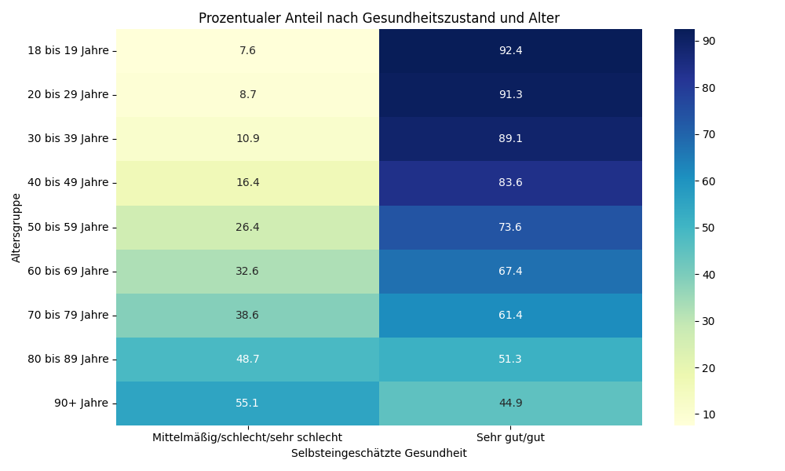

# Analyse 1: Subjektive Gesundheit nach Alter

## Fragestellung
Wie verändert sich die subjektive Gesundheit mit dem Alter?

## Ergebnisse
| age_label       |   Mittelmäßig/schlecht/sehr schlecht |   Sehr gut/gut |
|:----------------|-------------------------------------:|---------------:|
| 18 bis 19 Jahre |                              7.6087  |        92.3913 |
| 20 bis 29 Jahre |                              8.71321 |        91.2868 |
| 30 bis 39 Jahre |                             10.9317  |        89.0683 |
| 40 bis 49 Jahre |                             16.4241  |        83.5759 |
| 50 bis 59 Jahre |                             26.367   |        73.633  |
| 60 bis 69 Jahre |                             32.5567  |        67.4433 |
| 70 bis 79 Jahre |                             38.6338  |        61.3662 |
| 80 bis 89 Jahre |                             48.6503  |        51.3497 |
| 90+ Jahre       |                             55.0725  |        44.9275 |

**Statistik:**
- Chi-Quadrat: 1623.66
- p-Wert: 0.0000e+00
Interpretation: Ein p-Wert < 0.05 zeigt einen signifikanten Zusammenhang.

