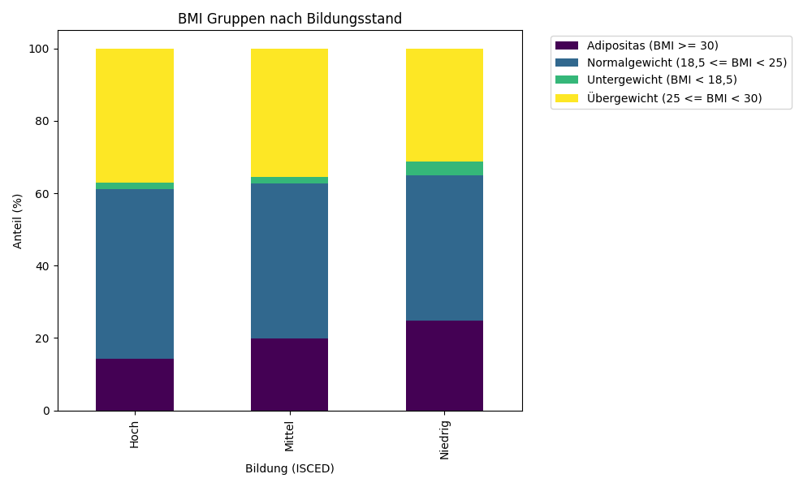

# Analyse 2: BMI und Bildung

## Fragestellung
Gibt es einen sozialen Gradienten beim Übergewicht?

## Ergebnisse
| edu_label   |   Adipositas (BMI >= 30) |   Normalgewicht (18,5 <= BMI < 25) |   Untergewicht (BMI < 18,5) |   Übergewicht (25 <= BMI < 30) |
|:------------|-------------------------:|-----------------------------------:|----------------------------:|-------------------------------:|
| Hoch        |                  14.2969 |                            46.9073 |                     1.63963 |                        37.1562 |
| Mittel      |                  19.8678 |                            42.7253 |                     1.90916 |                        35.4977 |
| Niedrig     |                  24.9039 |                            40.123  |                     3.68947 |                        31.2836 |

**Statistik:**
- Chi-Quadrat: 206.15
- p-Wert: 9.2900e-42

