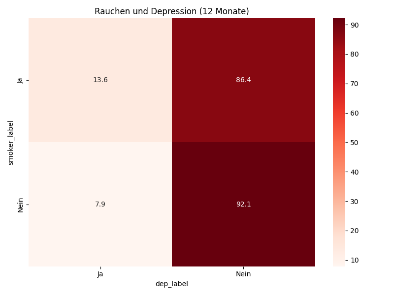

# Analyse 3: Rauchen und Depression

## Fragestellung
Rauchen Menschen mit Depression häufiger?

## Tabelle (Prozent)
| smoker_label   |       Ja |    Nein |
|:---------------|---------:|--------:|
| Ja             | 13.6289  | 86.3711 |
| Nein           |  7.86088 | 92.1391 |

**Statistik:**
- Chi-Quadrat: 152.65
- p-Wert: 4.5576e-35

