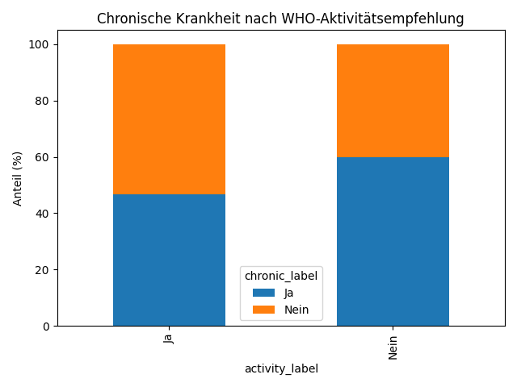

# Analyse 4: Bewegung und Chronische Krankheiten

## Fragestellung
Haben Menschen, die sich genug bewegen, weniger chronische Krankheiten?

| activity_label   |      Ja |    Nein |
|:-----------------|--------:|--------:|
| Ja               | 46.7086 | 53.2914 |
| Nein             | 59.7752 | 40.2248 |

**Statistik:**
- Chi-Quadrat: 320.47
- p-Wert: 1.1471e-71

