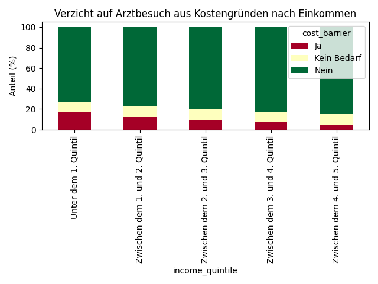

# Analyse 5: Arztbesuch-Verzicht aus Kostengründen

## Fragestellung
Verzichten ärmere Menschen häufiger auf Arztbesuche aus Geldmangel?

| income_quintile                |       Ja |   Kein Bedarf |    Nein |
|:-------------------------------|---------:|--------------:|--------:|
| Unter dem 1. Quintil           | 17.6515  |       9.22608 | 73.1224 |
| Zwischen dem 1. und 2. Quintil | 12.6895  |       9.60135 | 77.7092 |
| Zwischen dem 2. und 3. Quintil |  9.45978 |      10.3481  | 80.1921 |
| Zwischen dem 3. und 4. Quintil |  6.87585 |      10.3041  | 82.8201 |
| Zwischen dem 4. und 5. Quintil |  4.92611 |      10.4941  | 84.5798 |

**Statistik:**
- Chi-Quadrat: 465.73
- p-Wert: 1.5763e-95

